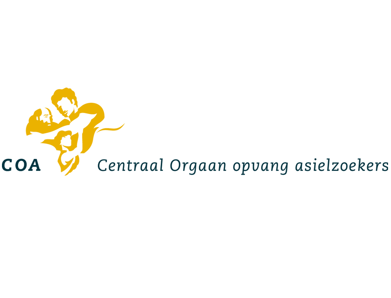
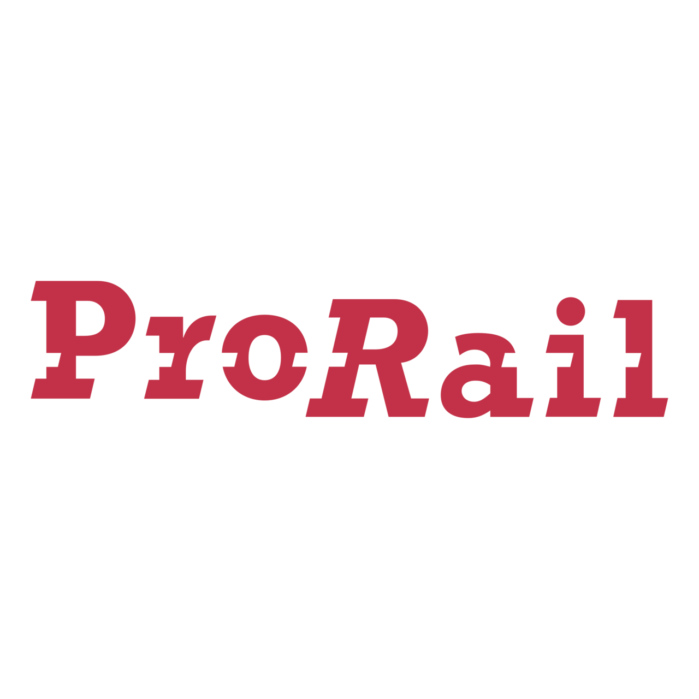
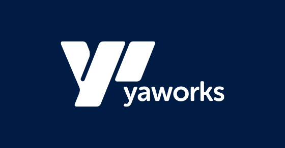

# Projects

**bartsmeding IT** publishes and maintains **open-source automation** (Ansible roles, Docker images) that we also use in **client work** and **training**. That keeps examples honest: what you see here is the same stack we recommend under real constraints.

Below is a **NetDevOps-oriented summary** of selected engagements. More background: **[LinkedIn](https://www.linkedin.com/in/bartsmeding/)**.

Use the rest of this page as a **map** to open assets; full listings and CI status are under **Ansible roles & collections** and **Docker images** in the navigation.

---

## Selected client work (NetDevOps)

| | |
|:--:|---|
| { width="72" } | **Centraal Orgaan opvang asielzoekers (COA)** — **Nautobot**-centred automation framework (HLD/LLD) for new sites, decommissioning, and **brownfield** operations; **Ansible** with **Tower/AWX** or **GitLab CI/CD** tied to **Cisco DNA Center**, **Infoblox**, **Panorama**, and **SolarWinds**; **7,000+** devices, **250+** locations; drift control, closed-loop change, **NOC** tests from the UI, and team **training**. |
| { width="72" } | **LeasePlan** — Global **automated configuration**, validation, and **auto-remediation** across **on-prem**, **datacentre**, and **cloud** using **NetBox**, **Git**, **Itential**, and **Ansible**, plus **Linux** server lifecycle (**RHEL/CentOS**), delivered in agile sprints. |
| { width="72" } | **DELTA Fiber Netherlands** — **FTTH** / **wholesale** automation: **Cisco IOS/XR** provisioning templates, **NetBox** → **AWX**, telemetry (**Influx**, **Grafana**), access-layer checks, and Ansible patterns for core, distribution, and access—including wholesale **onboarding** profiles. |
| { width="72" } | **ProRail** — **Capacity planning** and **nationwide monitoring**: reporting, automated MAN thresholds, and telemetry (**SNMP**, **NetFlow**, **NBAR**, **QoS**, delay/jitter) on Cisco and Alcatel kit, with **SevOne** and supporting tooling. |
| { width="72" } | **YaWorks** — Long-term **network automation** consulting: task automation, **auto-remediation**, **new-site** rollout, and **training**; home base for engagements such as **DELTA Fiber** and **ProRail**. |

---

## Ansible (open source)

- **[Ansible roles & collections](ansible_roles_and_collections.md)** — Galaxy overview, CI badges, downloads, and links to per-role documentation (AWX, Nautobot, GitLab, Docker host, observability stacks, and more).

---

## Docker

- **[Docker images](docker_images.md)** — Ansible-focused **CI/CD images** (multiple distros, network automation libraries) and **application images** (e.g. enhanced Nautobot).
- **[Nautobot container image](docker/docker_conatiner_nautobot.md)** — What is in the image and how it relates to the Ansible role.

---

## Writing & courses (NetDevOps.it)

| Resource | URL |
|----------|-----|
| Blog, tutorials, courses | [netdevops.it](https://netdevops.it/) |

Long-form education and community content stays on **NetDevOps.it**; **bartsmeding.nl** focuses on **services**, **maintained assets**, and **contact**.

---

*For more background and how to engage, see [About](about.md).*
